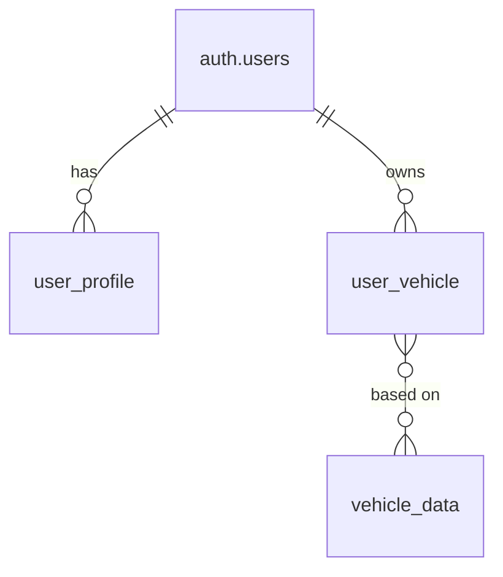

# Database Schema Reference

This document provides a comprehensive reference for the **FINAL** DDPC (Data-Driven Performance Car) database schema. This schema supports a streamlined vehicle collection application where users can browse vehicles and maintain personal collections.

**Last Updated**: Final simplified schema - direct user-to-vehicle ownership system.

## Overview

The database consists of 3 core tables that provide a clean, focused vehicle collection system:

- **Authentication**: Handled by Supabase Auth (`auth.users`)
- **User Management**: User profiles and roles (`user_profile`)
- **Vehicle Collection**: Direct user ownership of vehicles (`user_vehicle`)
- **Vehicle Catalog**: Stock vehicle data for browsing (`vehicle_data`)

## Table Relationships



## Final Table Schema

**Simplified to essential functionality only:**

```sql
-- WARNING: This schema is for context only and is not meant to be run.
-- This represents the final, working state after complete rebuild.

CREATE TABLE public.user_profile (
  user_id uuid NOT NULL,
  username text NOT NULL UNIQUE,
  display_name text,
  location text,
  website text,
  bio text,
  avatar_url text,
  is_public boolean NOT NULL DEFAULT true,
  created_at timestamp with time zone NOT NULL DEFAULT now(),
  updated_at timestamp with time zone NOT NULL DEFAULT now(),
  role USER-DEFINED NOT NULL DEFAULT 'user'::user_role CHECK (role = ANY (ARRAY['user'::user_role, 'helper'::user_role, 'admin'::user_role])),
  plan text NOT NULL DEFAULT 'free'::text CHECK (plan = ANY (ARRAY['free'::text, 'builder'::text, 'pro'::text])),
  banned boolean NOT NULL DEFAULT false,
  CONSTRAINT user_profile_pkey PRIMARY KEY (user_id),
  CONSTRAINT user_profile_user_id_fkey FOREIGN KEY (user_id) REFERENCES auth.users(id)
);

CREATE TABLE public.user_vehicle (
  id uuid NOT NULL DEFAULT gen_random_uuid(),
  vin text,
  year integer,
  make text NOT NULL,
  model text NOT NULL,
  trim text,
  nickname text,
  privacy text NOT NULL DEFAULT 'PRIVATE'::text CHECK (privacy = ANY (ARRAY['PUBLIC'::text, 'PRIVATE'::text])),
  photo_url text,
  created_at timestamp with time zone NOT NULL DEFAULT now(),
  last_event_at timestamp with time zone,
  stock_data_id text,
  title text,
  spec_snapshot jsonb,
  current_status text DEFAULT 'daily_driver'::text CHECK (current_status = ANY (ARRAY['daily_driver'::text, 'parked'::text, 'listed'::text, 'sold'::text, 'retired'::text])),
  owner_id uuid NOT NULL,
  CONSTRAINT user_vehicle_pkey PRIMARY KEY (id),
  CONSTRAINT vehicle_stock_data_id_fkey FOREIGN KEY (stock_data_id) REFERENCES public.vehicle_data(id),
  CONSTRAINT user_vehicle_owner_id_fkey FOREIGN KEY (owner_id) REFERENCES auth.users(id)
);

CREATE TABLE public.vehicle_data (
  id text NOT NULL,
  make text,
  model text,
  year text,
  trim text,
  trim_description text,
  base_msrp text,
  base_invoice text,
  colors_exterior text,
  colors_interior text,
  body_type text,
  doors text,
  total_seating text,
  length_in text,
  width_in text,
  height_in text,
  wheelbase_in text,
  front_track_in text,
  rear_track_in text,
  ground_clearance_in text,
  angle_of_approach_deg text,
  angle_of_departure_deg text,
  turning_circle_ft text,
  drag_coefficient_cd text,
  epa_interior_volume_cuft text,
  cargo_capacity_cuft text,
  max_cargo_capacity_cuft text,
  curb_weight_lbs text,
  gross_weight_lbs text,
  max_payload_lbs text,
  max_towing_capacity_lbs text,
  cylinders text,
  engine_size_l text,
  horsepower_hp text,
  horsepower_rpm text,
  torque_ft_lbs text,
  torque_rpm text,
  valves text,
  valve_timing text,
  cam_type text,
  drive_type text,
  transmission text,
  engine_type text,
  fuel_type text,
  fuel_tank_capacity_gal text,
  epa_combined_mpg text,
  epa_city_highway_mpg text,
  range_miles_city_hwy text,
  epa_combined_mpge text,
  epa_city_highway_mpge text,
  epa_electric_range_mi text,
  epa_kwh_per_100mi text,
  epa_charge_time_240v_hr text,
  battery_capacity_kwh text,
  front_head_room_in text,
  front_hip_room_in text,
  front_leg_room_in text,
  front_shoulder_room_in text,
  rear_head_room_in text,
  rear_hip_room_in text,
  rear_leg_room_in text,
  rear_shoulder_room_in text,
  warranty_basic text,
  warranty_drivetrain text,
  warranty_roadside text,
  warranty_rust text,
  source_json text,
  source_url text,
  image_url text,
  review text,
  pros text,
  cons text,
  whats_new text,
  nhtsa_overall_rating text,
  new_price_range text,
  used_price_range text,
  scorecard_overall text,
  scorecard_driving text,
  scorecard_confort text,
  scorecard_interior text,
  scorecard_utility text,
  scorecard_technology text,
  expert_verdict text,
  expert_performance text,
  expert_comfort text,
  expert_interior text,
  expert_technology text,
  expert_storage text,
  expert_fuel_economy text,
  expert_value text,
  expert_wildcard text,
  old_trim text,
  old_description text,
  images_url text,
  suspension text,
  front_seats text,
  rear_seats text,
  power_features text,
  instrumentation text,
  convenience text,
  comfort text,
  memorized_settings text,
  in_car_entertainment text,
  roof_and_glass text,
  body text,
  truck_features text,
  tires_and_wheels text,
  doors_features text,
  towing_and_hauling text,
  safety_features text,
  packages text,
  exterior_options text,
  interior_options text,
  mechanical_options text,
  country_of_origin text,
  car_classification text,
  platform_code_generation text,
  date_added text,
  new_make text,
  new_model text,
  new_year text,
  CONSTRAINT vehicle_data_pkey PRIMARY KEY (id)
);
```

## Table Details

### 1. user_profile
**Purpose**: Extended user information and role management for authenticated users.

**Key Fields**:
- `user_id` (uuid, FK → auth.users.id): Links to Supabase auth user
- `username` (text, UNIQUE): Unique username for display
- `display_name` (text): User's preferred display name
- `role` (enum): User role (user/helper/admin) - defaults to 'user'
- `plan` (enum): Subscription plan (free/builder/pro) - defaults to 'free'
- `is_public` (boolean): Whether profile is publicly visible
- `banned` (boolean): Admin ban status

**Relationships**:
- One-to-one with `auth.users`
- Referenced by application logic for user management

**Usage Notes**:
- Created automatically when user signs up
- Role determines feature access levels
- Plan affects feature availability

### 2. user_vehicle
**Purpose**: User's personal vehicle collection with direct ownership.

**Key Fields**:
- `id` (uuid, PK): Unique vehicle identifier
- `owner_id` (uuid, FK → auth.users.id): Direct owner of this vehicle
- `stock_data_id` (text, FK → vehicle_data.id): Reference to original vehicle specs
- `spec_snapshot` (jsonb): Frozen copy of specifications at time of addition
- Custom fields: `nickname`, `privacy`, `current_status`, etc.

**Relationships**:
- Owned directly by users (`owner_id`)
- References stock vehicle data
- Independent copies allow user modifications

**Usage Notes**:
- **Direct Ownership Model**: No intermediate garage abstraction
- Vehicles are owned directly by `auth.users`
- Each user can have unlimited vehicles
- Spec snapshots preserve original data integrity

### 3. vehicle_data
**Purpose**: Comprehensive stock vehicle specifications database.

**Key Fields**:
- `id` (text, PK): Unique vehicle data identifier (VIN-based)
- Extensive specification fields covering:
  - **Dimensions**: Length, width, height, wheelbase, etc.
  - **Engine**: Cylinders, horsepower, torque, fuel type, etc.
  - **Performance**: MPG, range, acceleration data
  - **Features**: Safety features, power features, packages
  - **Pricing**: MSRP, invoice, used price ranges
  - **Reviews**: Expert verdicts, pros/cons, scores

**Relationships**:
- Referenced by `user_vehicle.stock_data_id`
- Used to populate vehicle data when users add cars

**Usage Notes**:
- Contains comprehensive vehicle specifications
- Used as reference data for user vehicles
- Includes expert reviews and pricing information
- **Read-only**: Never modified by application

## Perfect Flow Architecture

### 🎯 **Core User Journey**
1. **Browse**: User explores `vehicle_data` via `/discover` page
2. **Select**: User clicks vehicle → sees specs from `vehicle_data`
3. **Add**: User clicks "Add to Collection" → creates `user_vehicle` record
4. **Manage**: User views personal collection at `/garage`

### 🔑 **Key Architectural Decisions**
1. **Direct Ownership**: `user_vehicle.owner_id` references `auth.users.id` directly
2. **Data Integrity**: `spec_snapshot` preserves original vehicle specs
3. **Flexibility**: Users can modify their copies without affecting originals
4. **Simplicity**: No complex multi-user sharing or event tracking

### 🛡️ **Security Model**
- **RLS Policies**: Direct `owner_id = auth.uid()` checks
- **No Recursion**: Clean, simple permission structure
- **Data Isolation**: Users only see their own vehicles

### 📈 **Performance Optimized**
- **73k vehicles** in `vehicle_data` (read-only reference data)
- **Direct queries** with indexed `owner_id` foreign key
- **JSON snapshots** for fast spec access
- **Minimal table joins** for optimal query performance

## Final State Summary

✅ **3 Tables**: `user_profile`, `user_vehicle`, `vehicle_data`
✅ **Direct Ownership**: Users own vehicles directly
✅ **Working System**: Add to collection functionality operational
✅ **Clean Architecture**: No complexity, no recursion issues
✅ **Scalable**: Easy to extend with future features (events, sharing, etc.)

**The system is now perfectly streamlined for vehicle collection with zero complexity!** 🚗✨
