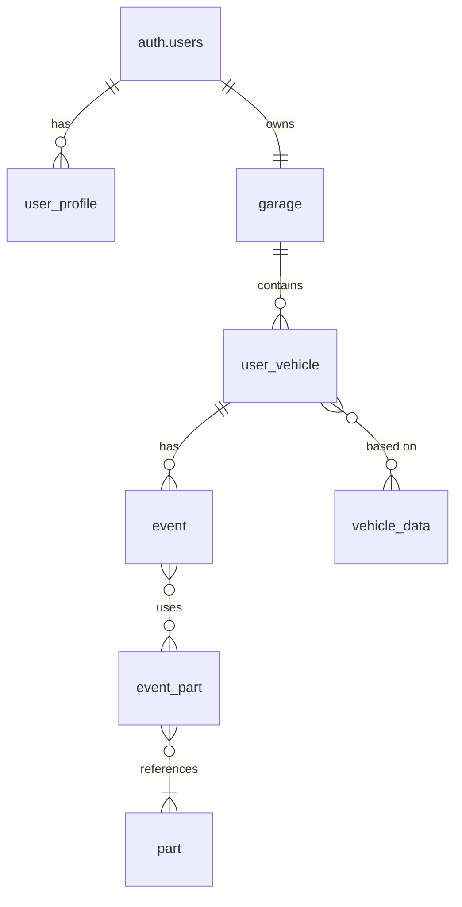

# Database Schema Reference

This document provides a comprehensive reference for the **CURRENT** DDPC (Data-Driven Performance Car) database schema. This schema supports a vehicle tracking and garage management application where users can maintain detailed records of their vehicles, parts, and maintenance/service history.

**Last Updated**: Based on current database state after garage system rebuild (single-user garages only).

## Overview

The database consists of 7 main tables that work together to provide a vehicle management system:

- **Authentication**: Handled by Supabase Auth (`auth.users`)
- **User Management**: User profiles and roles
- **Garage System**: Single-user garage ownership (simplified from multi-user)
- **Vehicle Management**: Vehicle ownership and specifications
- **Parts Catalog**: Available parts and components
- **Event Tracking**: Maintenance, service, and usage events
- **Event-Parts Relationships**: Many-to-many relationship between events and parts

## Table Relationships



## Current Table Schema

Based on the actual database state after the rebuild:

```sql
-- WARNING: This schema is for context only and is not meant to be run.
-- Table order and constraints may not be valid for execution.

CREATE TABLE public.event (
  id uuid NOT NULL DEFAULT gen_random_uuid(),
  vehicle_id uuid NOT NULL,
  type text NOT NULL CHECK (type = ANY (ARRAY['acquisition'::text, 'transfer'::text, 'install'::text, 'service'::text, 'damage'::text, 'track_day'::text, 'dyno'::text, 'note'::text])),
  title text NOT NULL,
  vendor_url text,
  cost numeric,
  notes text,
  metadata jsonb DEFAULT '{}'::jsonb,
  created_at timestamp with time zone NOT NULL DEFAULT now(),
  mileage integer,
  CONSTRAINT event_pkey PRIMARY KEY (id),
  CONSTRAINT event_vehicle_id_fkey FOREIGN KEY (vehicle_id) REFERENCES public.user_vehicle(id)
);

CREATE TABLE public.event_part (
  event_id uuid NOT NULL,
  part_id uuid NOT NULL,
  qty integer NOT NULL DEFAULT 1,
  CONSTRAINT event_part_pkey PRIMARY KEY (event_id, part_id),
  CONSTRAINT event_part_event_id_fkey FOREIGN KEY (event_id) REFERENCES public.event(id),
  CONSTRAINT event_part_part_id_fkey FOREIGN KEY (part_id) REFERENCES public.part(id)
);

CREATE TABLE public.garage (
  id uuid NOT NULL DEFAULT gen_random_uuid(),
  name text NOT NULL,
  type text DEFAULT 'PERSONAL'::text CHECK (type = ANY (ARRAY['PERSONAL'::text, 'SHOP'::text, 'CLUB'::text])),
  owner_id uuid NOT NULL UNIQUE,
  created_at timestamp with time zone NOT NULL DEFAULT now(),
  CONSTRAINT garage_pkey PRIMARY KEY (id),
  CONSTRAINT garage_owner_id_fkey FOREIGN KEY (owner_id) REFERENCES auth.users(id)
);

CREATE TABLE public.part (
  id uuid NOT NULL DEFAULT gen_random_uuid(),
  name text NOT NULL,
  brand text,
  affiliate_url text,
  created_at timestamp with time zone NOT NULL DEFAULT now(),
  CONSTRAINT part_pkey PRIMARY KEY (id)
);

CREATE TABLE public.user_profile (
  user_id uuid NOT NULL,
  username text NOT NULL UNIQUE,
  display_name text,
  location text,
  website text,
  bio text,
  avatar_url text,
  is_public boolean NOT NULL DEFAULT true,
  created_at timestamp with time zone NOT NULL DEFAULT now(),
  updated_at timestamp with time zone NOT NULL DEFAULT now(),
  role USER-DEFINED NOT NULL DEFAULT 'user'::user_role CHECK (role = ANY (ARRAY['user'::user_role, 'helper'::user_role, 'admin'::user_role])),
  plan text NOT NULL DEFAULT 'free'::text CHECK (plan = ANY (ARRAY['free'::text, 'builder'::text, 'pro'::text])),
  banned boolean NOT NULL DEFAULT false,
  CONSTRAINT user_profile_pkey PRIMARY KEY (user_id),
  CONSTRAINT user_profile_user_id_fkey FOREIGN KEY (user_id) REFERENCES auth.users(id)
);

CREATE TABLE public.user_vehicle (
  id uuid NOT NULL DEFAULT gen_random_uuid(),
  garage_id uuid NOT NULL,
  vin text,
  year integer,
  make text NOT NULL,
  model text NOT NULL,
  trim text,
  nickname text,
  privacy text NOT NULL DEFAULT 'PRIVATE'::text CHECK (privacy = ANY (ARRAY['PUBLIC'::text, 'PRIVATE'::text])),
  photo_url text,
  created_at timestamp with time zone NOT NULL DEFAULT now(),
  last_event_at timestamp with time zone,
  stock_data_id text,
  title text,
  spec_snapshot jsonb,
  current_status text DEFAULT 'daily_driver'::text CHECK (current_status = ANY (ARRAY['daily_driver'::text, 'parked'::text, 'listed'::text, 'sold'::text, 'retired'::text])),
  CONSTRAINT user_vehicle_pkey PRIMARY KEY (id),
  CONSTRAINT vehicle_garage_id_fkey FOREIGN KEY (garage_id) REFERENCES public.garage(id),
  CONSTRAINT vehicle_stock_data_id_fkey FOREIGN KEY (stock_data_id) REFERENCES public.vehicle_data(id)
);

CREATE TABLE public.vehicle_data (
  id text NOT NULL,
  make text,
  model text,
  year text,
  trim text,
  trim_description text,
  base_msrp text,
  base_invoice text,
  colors_exterior text,
  colors_interior text,
  body_type text,
  doors text,
  total_seating text,
  length_in text,
  width_in text,
  height_in text,
  wheelbase_in text,
  front_track_in text,
  rear_track_in text,
  ground_clearance_in text,
  angle_of_approach_deg text,
  angle_of_departure_deg text,
  turning_circle_ft text,
  drag_coefficient_cd text,
  epa_interior_volume_cuft text,
  cargo_capacity_cuft text,
  max_cargo_capacity_cuft text,
  curb_weight_lbs text,
  gross_weight_lbs text,
  max_payload_lbs text,
  max_towing_capacity_lbs text,
  cylinders text,
  engine_size_l text,
  horsepower_hp text,
  horsepower_rpm text,
  torque_ft_lbs text,
  torque_rpm text,
  valves text,
  valve_timing text,
  cam_type text,
  drive_type text,
  transmission text,
  engine_type text,
  fuel_type text,
  fuel_tank_capacity_gal text,
  epa_combined_mpg text,
  epa_city_highway_mpg text,
  range_miles_city_hwy text,
  epa_combined_mpge text,
  epa_city_highway_mpge text,
  epa_electric_range_mi text,
  epa_kwh_per_100mi text,
  epa_charge_time_240v_hr text,
  battery_capacity_kwh text,
  front_head_room_in text,
  front_hip_room_in text,
  front_leg_room_in text,
  front_shoulder_room_in text,
  rear_head_room_in text,
  rear_hip_room_in text,
  rear_leg_room_in text,
  rear_shoulder_room_in text,
  warranty_basic text,
  warranty_drivetrain text,
  warranty_roadside text,
  warranty_rust text,
  source_json text,
  source_url text,
  image_url text,
  review text,
  pros text,
  cons text,
  whats_new text,
  nhtsa_overall_rating text,
  new_price_range text,
  used_price_range text,
  scorecard_overall text,
  scorecard_driving text,
  scorecard_confort text,
  scorecard_interior text,
  scorecard_utility text,
  scorecard_technology text,
  expert_verdict text,
  expert_performance text,
  expert_comfort text,
  expert_interior text,
  expert_technology text,
  expert_storage text,
  expert_fuel_economy text,
  expert_value text,
  expert_wildcard text,
  old_trim text,
  old_description text,
  images_url text,
  suspension text,
  front_seats text,
  rear_seats text,
  power_features text,
  instrumentation text,
  convenience text,
  comfort text,
  memorized_settings text,
  in_car_entertainment text,
  roof_and_glass text,
  body text,
  truck_features text,
  tires_and_wheels text,
  doors_features text,
  towing_and_hauling text,
  safety_features text,
  packages text,
  exterior_options text,
  interior_options text,
  mechanical_options text,
  country_of_origin text,
  car_classification text,
  platform_code_generation text,
  date_added text,
  new_make text,
  new_model text,
  new_year text,
  CONSTRAINT vehicle_data_pkey PRIMARY KEY (id)
);
```

## Table Details

### 1. garage (Simplified)
**Purpose**: Single-user garage ownership (simplified from multi-user system).

**Key Changes from Previous Version**:
- Removed `garage_member` table and all multi-user functionality
- Each user can have only one garage (`owner_id` is UNIQUE)
- Direct ownership model: `owner_id = auth.uid()`

### 2. user_vehicle
**Purpose**: Individual vehicle records owned by users within garages.

**Key Changes**:
- All policies now check garage ownership directly
- No more complex membership checks
- Simplified to: `garage_id IN (SELECT id FROM garage WHERE owner_id = auth.uid())`

### 3. event & event_part
**Purpose**: Tracking all vehicle-related events and parts usage.

**Key Changes**:
- Policies now check through the ownership chain: event → vehicle → garage → owner
- Simplified permission structure

### 4. Other Tables
**Purpose**: Remain largely unchanged (user_profile, part, vehicle_data).

## Key Architectural Changes

1. **Removed Multi-User Support**: No more `garage_member` table
2. **Direct Ownership**: Garages are owned directly by users
3. **Simplified Policies**: All RLS policies check `garage.owner_id = auth.uid()`
4. **No Recursion**: Eliminated cross-table policy dependencies

## Data Flow Examples

### Adding a New Vehicle
1. User selects vehicle from vehicle_data
2. Creates user_vehicle record in their garage
3. Optionally creates "acquisition" event
4. Vehicle appears in garage with specifications

### Recording Maintenance
1. User creates service event for a vehicle
2. Associates relevant parts with quantities
3. Records cost, mileage, and notes
4. Event appears in vehicle history

### Garage Sharing
1. User creates garage with SHOP/CLUB type
2. Invites other users as members
3. Members can view/add vehicles and events
4. Owner maintains administrative control

## Security Considerations

- **Row Level Security (RLS)**: All tables should have RLS enabled
- **Garage-based Access**: Users can only access vehicles in garages they're members of
- **Owner Privileges**: Garage owners have full control over their garages
- **Public/Private Vehicles**: Privacy settings control visibility
- **User Profile Privacy**: Users can make profiles private

## Performance Considerations

- **Indexing**: Primary keys and foreign keys should be indexed
- **JSONB Operations**: Efficient querying of metadata and spec_snapshot
- **Pagination**: Large result sets should be paginated
- **Caching**: Frequently accessed vehicle_data can be cached
- **Archiving**: Old events may need archiving for performance

## Migration Notes

⚠️ **Warning**: This schema is for reference only and should not be executed directly. Table creation order and constraint dependencies must be carefully managed during migrations.

- Create tables in dependency order: auth.users → user_profile → garage → garage_member → user_vehicle → vehicle_data → event → part → event_part
- Foreign key constraints require parent tables to exist first
- Consider using migration tools like Supabase migrations or Flyway
- Test migrations on development environment before production deployment
