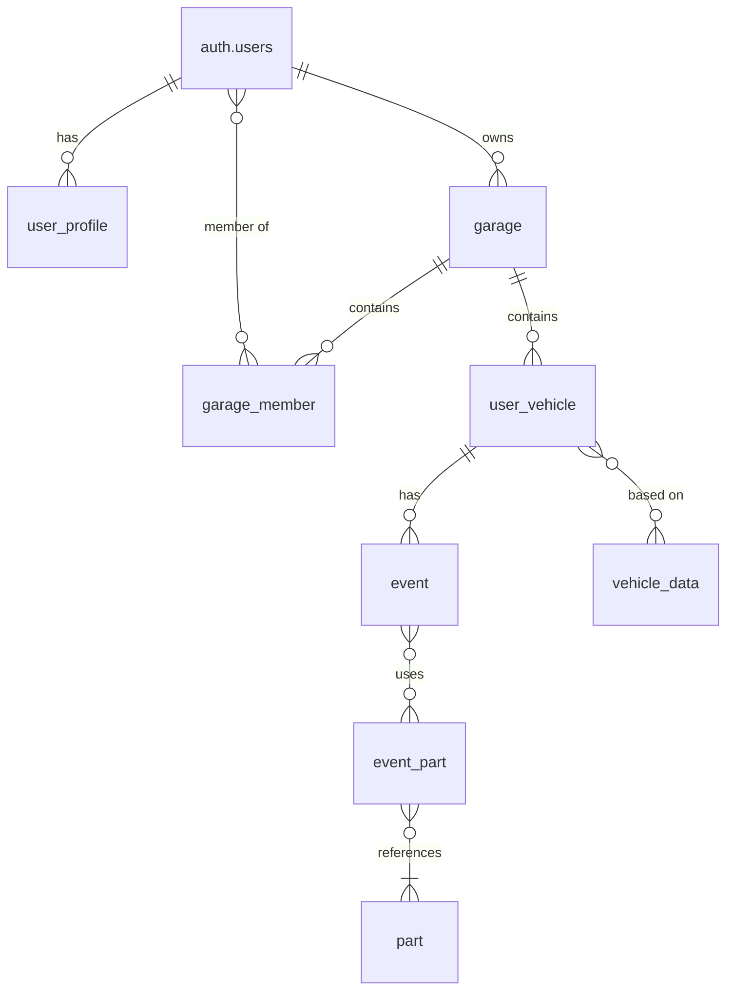

# Database Schema Reference

This document provides a comprehensive reference for the DDPC (Data-Driven Performance Car) database schema. This schema supports a vehicle tracking and garage management application where users can maintain detailed records of their vehicles, parts, and maintenance/service history.

## Overview

The database consists of 8 main tables that work together to provide a complete vehicle management system:

- **Authentication**: Handled by Supabase Auth (`auth.users`)
- **User Management**: User profiles and roles
- **Garage System**: Multi-user garage management
- **Vehicle Management**: Vehicle ownership and specifications
- **Parts Catalog**: Available parts and components
- **Event Tracking**: Maintenance, service, and usage events
- **Event-Parts Relationships**: Many-to-many relationship between events and parts

## Table Relationships

## Table Details

### 1. user_profile

**Purpose**: Extended user information and role management for authenticated users.

**Key Fields**:
- `user_id` (uuid, FK → auth.users.id): Links to Supabase auth user
- `username` (text, UNIQUE): Unique username for display
- `display_name` (text): User's preferred display name
- `role` (enum): User role (user/helper/admin) - defaults to 'user'
- `plan` (enum): Subscription plan (free/builder/pro) - defaults to 'free'
- `is_public` (boolean): Whether profile is publicly visible
- `banned` (boolean): Admin ban status

**Relationships**:
- One-to-one with `auth.users`
- Referenced by garage membership and ownership

**Usage Notes**:
- Created automatically when user signs up
- Role determines feature access levels
- Plan affects feature availability

### 2. garage

**Purpose**: Multi-user garage management allowing shared vehicle ownership.

**Key Fields**:
- `id` (uuid, PK): Unique garage identifier
- `name` (text): User-defined garage name
- `type` (enum): Garage type (PERSONAL/SHOP/CLUB) - defaults to 'PERSONAL'
- `owner_id` (uuid, FK → auth.users.id, UNIQUE): Garage owner

**Relationships**:
- Owned by one user (owner_id)
- Can have multiple members (garage_member)
- Contains multiple vehicles (user_vehicle)

**Usage Notes**:
- Personal garages are private to the owner
- Shop/Club garages can have multiple members
- Owner has full control over garage settings

### 3. garage_member

**Purpose**: Junction table managing garage membership and roles.

**Key Fields**:
- `garage_id` (uuid, FK → garage.id): Reference to garage
- `user_id` (uuid, FK → auth.users.id): Reference to user
- `role` (enum): Member role (OWNER/MEMBER) - defaults to 'MEMBER'

**Relationships**:
- Composite primary key (garage_id, user_id)
- Links users to garages with specific roles

**Usage Notes**:
- Owners automatically get OWNER role when creating garage
- Members can be invited to join garages
- Role determines permissions within the garage

### 4. user_vehicle

**Purpose**: Individual vehicle records owned by users within garages.

**Key Fields**:
- `id` (uuid, PK): Unique vehicle identifier
- `garage_id` (uuid, FK → garage.id): Parent garage
- `vin` (text): Vehicle identification number
- `year` (integer): Model year
- `make` (text): Vehicle manufacturer
- `model` (text): Vehicle model
- `trim` (text): Vehicle trim level
- `nickname` (text): User-defined vehicle nickname
- `privacy` (enum): Visibility setting (PUBLIC/PRIVATE) - defaults to 'PRIVATE'
- `photo_url` (text): Vehicle photo URL
- `current_status` (enum): Current vehicle status (daily_driver/parked/listed/sold/retired)
- `stock_data_id` (text, FK → vehicle_data.id): Reference to stock specifications
- `spec_snapshot` (jsonb): Frozen copy of specifications at time of addition
- `last_event_at` (timestamptz): Timestamp of most recent event

**Relationships**:
- Belongs to one garage
- Can reference stock vehicle data
- Has many events (maintenance, service, etc.)

**Usage Notes**:
- Vehicles are owned by garages, not individual users
- Privacy setting controls public visibility
- Status tracking helps with garage organization

### 5. vehicle_data

**Purpose**: Comprehensive stock vehicle specifications database.

**Key Fields**:
- `id` (text, PK): Unique vehicle data identifier (likely VIN-based)
- Extensive specification fields covering:
  - **Dimensions**: Length, width, height, wheelbase, etc.
  - **Engine**: Cylinders, horsepower, torque, fuel type, etc.
  - **Performance**: MPG, range, acceleration data
  - **Features**: Safety features, power features, packages
  - **Pricing**: MSRP, invoice, used price ranges
  - **Reviews**: Expert verdicts, pros/cons, scores

**Relationships**:
- Referenced by user_vehicle for stock specifications
- Used to populate vehicle data when users add cars

**Usage Notes**:
- Contains comprehensive vehicle specifications
- Used as reference data for user vehicles
- Includes expert reviews and pricing information

### 6. event

**Purpose**: Tracking all vehicle-related events (maintenance, service, usage).

**Key Fields**:
- `id` (uuid, PK): Unique event identifier
- `vehicle_id` (uuid, FK → user_vehicle.id): Associated vehicle
- `type` (enum): Event type (acquisition/transfer/install/service/damage/track_day/dyno/note)
- `title` (text): Event title/description
- `vendor_url` (text): Link to vendor/service provider
- `cost` (numeric): Cost of the event
- `notes` (text): Detailed notes about the event
- `metadata` (jsonb): Flexible additional data storage
- `mileage` (integer): Vehicle mileage at time of event

**Relationships**:
- Belongs to one vehicle
- Can have multiple parts associated (event_part)

**Usage Notes**:
- Comprehensive event tracking for vehicle history
- Supports various event types from purchases to track days
- Cost tracking for maintenance budgeting
- Mileage tracking for service intervals

### 7. part

**Purpose**: Catalog of available vehicle parts and components.

**Key Fields**:
- `id` (uuid, PK): Unique part identifier
- `name` (text): Part name/description
- `brand` (text): Part manufacturer/brand
- `affiliate_url` (text): Affiliate link for purchasing

**Relationships**:
- Referenced by event_part for usage tracking
- Can be used in multiple events

**Usage Notes**:
- Global parts catalog shared across all users
- Supports affiliate marketing through links
- Allows tracking of parts usage across events

### 8. event_part

**Purpose**: Junction table linking events to parts with quantities.

**Key Fields**:
- `event_id` (uuid, FK → event.id): Reference to event
- `part_id` (uuid, FK → part.id): Reference to part
- `qty` (integer): Quantity of parts used - defaults to 1

**Relationships**:
- Composite primary key (event_id, part_id)
- Links events to specific parts with quantities

**Usage Notes**:
- Supports many-to-many relationship between events and parts
- Quantity tracking for multi-part installations
- Enables detailed parts usage analytics

## Data Flow Examples

### Adding a New Vehicle
1. User selects vehicle from vehicle_data
2. Creates user_vehicle record in their garage
3. Optionally creates "acquisition" event
4. Vehicle appears in garage with specifications

### Recording Maintenance
1. User creates service event for a vehicle
2. Associates relevant parts with quantities
3. Records cost, mileage, and notes
4. Event appears in vehicle history

### Garage Sharing
1. User creates garage with SHOP/CLUB type
2. Invites other users as members
3. Members can view/add vehicles and events
4. Owner maintains administrative control

## Security Considerations

- **Row Level Security (RLS)**: All tables should have RLS enabled
- **Garage-based Access**: Users can only access vehicles in garages they're members of
- **Owner Privileges**: Garage owners have full control over their garages
- **Public/Private Vehicles**: Privacy settings control visibility
- **User Profile Privacy**: Users can make profiles private

## Performance Considerations

- **Indexing**: Primary keys and foreign keys should be indexed
- **JSONB Operations**: Efficient querying of metadata and spec_snapshot
- **Pagination**: Large result sets should be paginated
- **Caching**: Frequently accessed vehicle_data can be cached
- **Archiving**: Old events may need archiving for performance

## Migration Notes

⚠️ **Warning**: This schema is for reference only and should not be executed directly. Table creation order and constraint dependencies must be carefully managed during migrations.

- Create tables in dependency order: auth.users → user_profile → garage → garage_member → user_vehicle → vehicle_data → event → part → event_part
- Foreign key constraints require parent tables to exist first
- Consider using migration tools like Supabase migrations or Flyway
- Test migrations on development environment before production deployment
